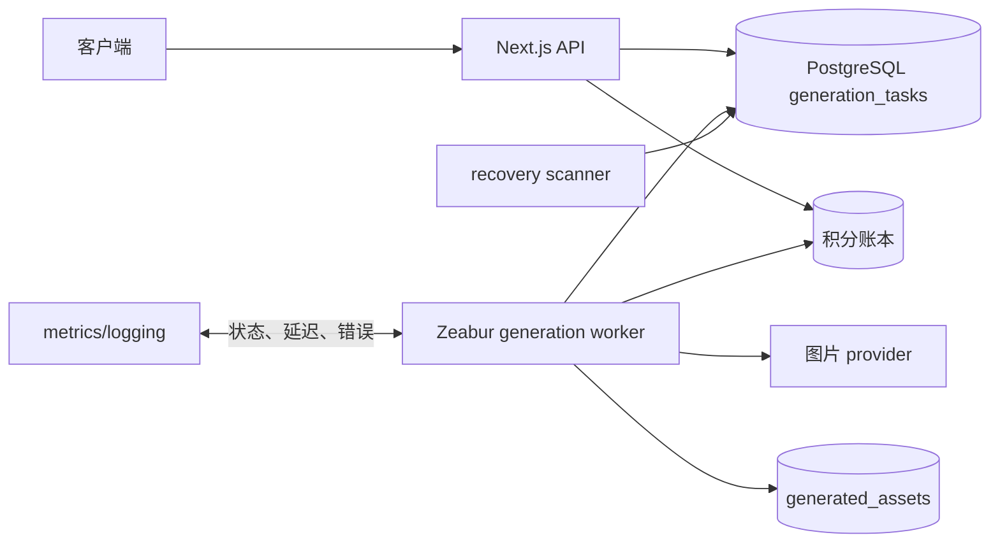
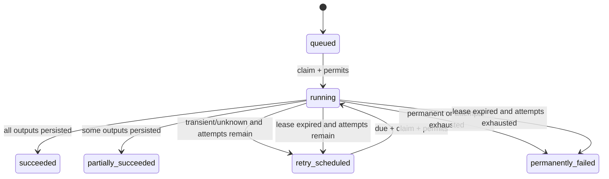

# 图片生成异步任务处理详细设计

## 1. 文档信息

| 字段 | 内容 |
| --- | --- |
| Feature | `0005_async-concurrency-processing` |
| 文档 | 异步任务处理详细设计 |
| 状态 | 已批准，待实施 |
| 首个接入场景 | 图片生成与重新生成 |
| 运行代码 | `ima ima queencard/src/src/` |
| 部署目标 | 独立 Zeabur worker 服务，共享 PostgreSQL |
| 创建日期 | 2026-08-02 |

## 2. 决策摘要

本 feature 把图片生成从 Next.js 请求生命周期中移出。Next.js 负责鉴权、校验、
冻结积分、创建任务和返回任务标识；独立 TypeScript worker 负责领取任务、调用 provider、
写入资产、结算积分、重试和故障恢复。PostgreSQL 同时承担任务事实表和首版持久队列，
不在没有容量证据时引入 Redis、BullMQ 或独立 FastAPI 服务。

首版固定参数：

| 参数 | 值 |
| --- | ---: |
| 最大执行次数 | 3 |
| provider 单次硬超时 | 300 秒 |
| worker 心跳间隔 | 30 秒 |
| 任务租约有效期 | 120 秒 |
| 崩溃后重新可领取目标 | 不超过 150 秒 |
| 重试退避 | 5 秒、30 秒、120 秒，附加 ±20% jitter |
| 创建任务 API P95 | 小于 500 ms |
| 有容量时排队到执行 P95 | 小于 5 秒 |
| 30 分钟内进入终态的比例 | 不低于 99.9%；所有任务最终不得永久卡住 |

## 3. 背景与当前基线

当前 `POST /api/v1/image-generations` 和重新生成接口会先写入 `queued` 任务，再通过
Next.js `after()` 启动 `runImageGenerationTask()`。service 使用带状态条件的更新把
任务从 `queued` 改为 `generating`，从而降低同一任务被同时启动的概率。

当前代码入口：

| 职责 | 路径 |
| --- | --- |
| 创建、执行、查询任务 | `ima ima queencard/src/src/services/image-generation.ts` |
| 创建任务 API | `ima ima queencard/src/src/app/api/v1/image-generations/route.ts` |
| 重新生成 API | `ima ima queencard/src/src/app/api/v1/image-generations/[taskId]/regenerate/route.ts` |
| provider 调用 | `ima ima queencard/src/src/services/image-provider.ts` |
| GPTProto 任务与轮询 | `ima ima queencard/src/src/services/gptproto.ts` |
| 积分账本 | `ima ima queencard/src/src/services/credit.ts` |
| 数据模型 | `ima ima queencard/src/src/db/schema.ts` |

现状有四个生产风险：

1. `after()` 仍依赖 Web 进程存活；部署、扩缩容或回收进程会中断执行。
2. `generating` 没有租约和心跳，进程退出后任务可能永久卡住。
3. 没有统一重试、错误分类和硬超时，临时故障与永久故障无法稳定区分。
4. 任务、资产和积分虽各有状态，但缺少跨重试的完整幂等契约。

## 4. 范围

### 4.1 本期范围

- 图片生成和重新生成 API 改为只创建持久任务。
- 在现有 TypeScript 应用包中新增可独立启动的 worker 入口。
- PostgreSQL 原子领取、租约、心跳、重试调度和过期恢复。
- 任务、生成资产和积分冻结/结算/释放的幂等闭环。
- 结构化日志、核心指标、健康检查和灰度开关。
- 单元、数据库集成、worker 集成、故障注入和容量测试。

### 4.2 明确不做

- 不建设通用工作流编排平台。
- 不接入 Redis/BullMQ、Kafka 或其他消息中间件。
- 不把支付 webhook、邮件、数据导出等场景同步迁入。
- 不实现用户可见的任务取消；provider 没有可靠取消协议时，数据库状态不能假装取消成功。
- 不实现付费优先队列、多租户配额销售或复杂优先级策略。
- 不迁移到 FastAPI，也不重写 provider adapter 与积分账本。

## 5. 设计原则与不可破坏约束

| 编号 | 约束 |
| --- | --- |
| ASYNC-I01 | HTTP 请求返回后，任务事实必须已持久化，且不依赖 Web 进程继续运行。 |
| ASYNC-I02 | provider 网络调用不得位于数据库事务内。 |
| ASYNC-I03 | 同一任务同一时刻最多存在一个有效任务租约。 |
| ASYNC-I04 | 只有当前 `leaseOwner + version` 匹配的 worker 能更新执行态和终态。 |
| ASYNC-I05 | 同一 `taskId` 最多形成一次有效积分最终结算。 |
| ASYNC-I06 | 同一 `(taskId, outputIndex)` 最多存在一个有效资产。 |
| ASYNC-I07 | worker 崩溃不能要求人工改库才能恢复队列容量。 |
| ASYNC-I08 | 所有失败都必须进入可查询终态或下一次明确调度，不允许静默丢失。 |
| ASYNC-I09 | 500 响应、日志和指标标签不得泄露 provider 凭证、数据库 URL 或用户敏感数据。 |

## 6. 目标架构与组件边界



### 6.1 API 层

API 层只承担：鉴权、输入标准化、幂等请求识别、积分冻结、任务创建和响应组装。
它不导入 worker loop，也不直接调用 provider。

### 6.2 Queue repository

Queue repository 封装所有状态转换 SQL：创建、领取、续租、重试、成功、失败、租约恢复。
业务层不能散落编写状态更新 SQL。每个方法返回是否成功以及失败原因，调用者不得把
“更新 0 行”视为成功。

### 6.3 Worker runtime

Worker runtime 只负责生命周期：启动、轮询、并发槽位、心跳、执行、优雅停止和健康状态。
它通过接口调用 queue repository 和 task executor，不了解 API route。

### 6.4 Task executor

Task executor 执行单个已持有租约的任务：加载输入、确认积分冻结、调用 provider、规范化结果、
写资产、结算或释放积分。它不负责从队列选择任务。

### 6.5 Recovery scanner

Recovery scanner 每 30 秒扫描已过期的 `running` 租约。它根据尝试次数和错误历史把任务
转为 `retry_scheduled` 或 `permanently_failed`，并释放已过期的并发 permit。

## 7. 端到端数据流

### 7.1 创建任务

1. API 完成用户鉴权和输入校验。
2. 服务端生成 `taskId`；若客户端提供 `idempotencyKey`，先查询同用户已有任务。
3. 在一个数据库事务中冻结预计积分并创建 `queued` 任务；`creditHoldKey = taskId`。
4. 事务提交后返回 HTTP 202、任务公开字段和查询 URL。
5. 如果同一用户重复提交相同 `idempotencyKey`，返回原任务，不创建第二次积分冻结。

事务失败时，任务与积分冻结均不得留下半成品。API 不承诺任务已开始，只承诺任务已被可靠接受。

### 7.2 领取与执行

1. worker 查询 `nextAttemptAt <= now()` 的可运行候选任务。
2. 在短事务中获取并发 permit，并用 `FOR UPDATE SKIP LOCKED` 领取任务。
3. 写入 `running`、`leaseOwner`、`leaseExpiresAt`、`heartbeatAt`，增加 `attemptCount` 和 `version`。
4. 提交领取事务后才调用 provider。
5. worker 每 30 秒续租任务和 permit；续租失败时标记执行权丢失。
6. provider 返回后，executor 校验执行权，再写资产、结算积分和提交任务终态。

### 7.3 失去执行权

worker 发现续租更新 0 行、`version` 不匹配或租约已被新 worker 接管时，必须停止写入任务终态。
如果 provider 已返回结果，旧 worker 可以记录“stale result discarded”指标，但不能覆盖新执行者。
外部 provider 无法取消时，旧调用可能继续消耗上游资源；数据库幂等约束负责阻止重复资产和扣费。

## 8. 状态机

### 8.1 状态定义

| 状态 | 含义 | 是否终态 |
| --- | --- | --- |
| `queued` | 已接受，等待首次领取 | 否 |
| `running` | 有有效租约的 worker 正在执行 | 否 |
| `retry_scheduled` | 已失败但允许重试，等待 `nextAttemptAt` | 否 |
| `succeeded` | 所有预期输出均成功 | 是 |
| `partially_succeeded` | 至少一个输出成功，但少于预期数量 | 是 |
| `permanently_failed` | 无有效输出，且不再自动重试 | 是 |

### 8.2 合法转换



任何其他转换都必须被 repository 拒绝并记录 `invalid_state_transition_total`。终态不可重新进入
执行态；用户“重新生成”必须创建新任务，并通过 `parentTaskId` 关联原任务。

## 9. 数据模型变更

### 9.1 `generation_tasks` 新增字段

| 字段 | 类型/默认值 | 规则 |
| --- | --- | --- |
| `idempotency_key` | text，可空 | 与 `user_id` 组成条件唯一索引 |
| `parent_task_id` | text，可空 | 重新生成时指向原任务 |
| `priority` | smallint，默认 0 | 首版 API 固定为 0，不向用户开放 |
| `attempt_count` | integer，默认 0 | 领取成功后增加，范围 0～3 |
| `max_attempts` | integer，默认 3 | 首版固定 3，范围 1～5 |
| `next_attempt_at` | timestamp，默认 now | 只有到期任务可领取 |
| `lease_owner` | text，可空 | `running` 时必填 |
| `lease_expires_at` | timestamp，可空 | `running` 时必填 |
| `heartbeat_at` | timestamp，可空 | 最近一次续租时间 |
| `version` | integer，默认 0 | 每次领取和恢复时递增 |
| `failure_category` | text，可空 | `transient/permanent/unknown` |
| `last_error_at` | timestamp，可空 | 最近错误时间 |

现有 `error_code` 用作稳定内部错误码，`error_message` 保存经过脱敏、可展示或可运营查询的描述。
provider 原始错误只允许进入受控诊断日志，不直接写入用户响应。

### 9.2 索引与约束

- 可运行任务索引：`(status, next_attempt_at, priority DESC, created_at)`。
- 租约恢复索引：`(status, lease_expires_at)`，仅覆盖 `running`。
- 条件唯一索引：`(user_id, idempotency_key)`，仅覆盖非空值。
- `attempt_count >= 0 AND attempt_count <= max_attempts`。
- `max_attempts >= 1 AND max_attempts <= 5`。
- `running` 状态要求三个租约字段非空；非 `running` 状态要求 `lease_owner` 为空。
- `generated_assets(task_id, output_index)` 唯一约束。

## 10. 积分与资产一致性

### 10.1 积分生命周期

| 任务事件 | 积分动作 |
| --- | --- |
| 任务创建 | 按预计成本冻结，键为 `taskId` |
| 重试 | 复用原冻结，不创建新 hold |
| 全部成功 | 按实际成本结算，释放差额 |
| 部分成功 | 只结算有效资产成本，释放剩余冻结 |
| 永久失败且无资产 | 全部释放 |
| worker 崩溃 | 保持冻结，等待恢复任务收敛 |

积分账本是余额事实来源。不得通过直接更新用户余额来补偿队列错误。结算接口必须按
`creditHoldKey` 幂等；重复调用返回原结果，不重复写有效流水。

### 10.2 资产写入

每个 provider 输出映射到稳定 `outputIndex`。写入使用唯一约束保护；同一任务重试时，已存在的
输出采用读取原记录或幂等 upsert，不新建第二条资产。只有成功持久化且可供用户访问的资产才计费。

任务终态、资产结果和积分动作应在同一事务中提交；如果积分服务的现有边界无法做到单事务，
则使用可重复执行的 finalize transaction，并以任务 `version` 和 `creditHoldKey` 保证收敛。

## 11. 错误分类与重试

| 类别 | 示例 | 自动重试 | 处理 |
| --- | --- | ---: | --- |
| `transient` | 429、provider 5xx、连接重置、临时 DNS 错误 | 是 | 按退避表重试 |
| `permanent` | 参数非法、模型不支持、明确内容策略拒绝 | 否 | 立即永久失败 |
| `unknown` | 未归类异常、非标准 provider 响应 | 有限 | 剩余次数内重试并告警 |

每次 provider 调用的总 wall-clock 硬超时为 300 秒。超时归入 `transient`。第 1、2、3 次
执行之间的基础退避分别为 5、30、120 秒，并加入 ±20% 随机抖动。`Retry-After` 大于基础退避
时优先采用 provider 值，但单次延迟上限为 15 分钟，避免异常响应把任务永久推迟。

## 12. Worker 生命周期

### 12.1 启动

- 校验数据库连接和全部数值配置。
- `heartbeatMs` 必须小于等于 `leaseMs / 3`。
- `providerTimeoutMs` 可以大于租约，但 worker 必须持续续租。
- 生成稳定 `workerId = deploymentId:processId:randomSuffix`。
- 数据库不可用时 worker 启动失败并由 Zeabur 重启，不进入假健康状态。

### 12.2 运行

- 有空闲执行槽位时才扫描候选任务。
- 空队列从 1 秒开始退避，最高 5 秒，并加入 jitter。
- 单轮候选数量固定 20；本地空闲槽位少于 20 时仍允许跳过受限用户和 provider。
- 每个任务执行在隔离的 Promise 中，错误必须回到统一终态处理器。

### 12.3 优雅停止

收到 `SIGTERM` 后立即停止领取新任务，继续为在途任务续租，最多等待 330 秒：300 秒 provider
超时加 30 秒 finalize 缓冲。超过时间后停止续租并退出，让租约恢复机制接管。健康检查在 draining
期间返回不接受新工作，但进程存活检查继续成功。

## 13. API 契约

### 13.1 创建任务

请求允许新增：

```json
{
  "idempotencyKey": "client-generated-8-to-120-chars",
  "prompt": "...",
  "model": "..."
}
```

成功响应为 HTTP 202：

```json
{
  "success": true,
  "data": {
    "taskId": "gen_xxx",
    "status": "queued",
    "statusUrl": "/api/v1/image-generations/gen_xxx",
    "redirectUrl": "/generated?taskId=gen_xxx"
  }
}
```

同一用户和 `idempotencyKey` 的重复请求返回相同 `taskId`。输入不合法为 400，额度不足为 402，
未登录为 401。系统接受任务后不得因 worker 暂时离线改成 500。

### 13.2 查询任务

查询返回公开状态、尝试次数、创建/开始/完成时间、可展示错误和资产。不得返回 `leaseOwner`、
provider 原始响应、内部堆栈或数据库字段。`retry_scheduled` 可返回下一次重试的近似时间。

## 14. 可观测性

### 14.1 指标

| 指标 | 类型 | 关键标签 |
| --- | --- | --- |
| `generation_queue_depth` | gauge | status, provider, model |
| `generation_oldest_wait_seconds` | gauge | provider, model |
| `generation_claim_duration_ms` | histogram | result |
| `generation_task_duration_ms` | histogram | provider, model, result |
| `generation_attempt_total` | counter | provider, model, result, category |
| `generation_lease_expired_total` | counter | provider, model |
| `generation_stale_result_total` | counter | provider, model |
| `generation_invalid_transition_total` | counter | from, to |
| `generation_credit_inconsistency_total` | counter | kind |

`userId`、`taskId` 和 prompt 不得作为指标标签，避免高基数与隐私泄漏；它们只进入受控结构化日志。

### 14.2 日志字段

每条任务日志至少包含：`event`、`taskId`、脱敏 `userId`、`workerId`、`attempt`、`version`、
`provider`、`model`、`fromStatus`、`toStatus`、`durationMs` 和稳定 `errorCode`。日志不得记录密钥、
数据库 URL、完整参考图 URL 或完整 provider 原始响应。

## 15. 部署、灰度与回滚

1. 先部署只增加字段、索引和约束的兼容迁移。
2. 部署兼容新旧状态读取的 Web 代码，但保留旧执行开关。
3. 部署独立 worker，保持消费开关关闭，验证健康检查与数据库权限。
4. 测试环境以单 worker、并发 1 完成全部故障注入。
5. 生产把 10% 新任务路由到 worker，并发 2，观察至少 24 小时。
6. 通过验收后切换 100%，并发提高到 4，删除 route 的 `after()` 执行路径。

零容忍回滚条件：重复扣费、重复有效资产、并发越界或任务无法自动恢复。回滚时先关闭新任务领取，
等待在途任务完成或租约过期，再恢复旧执行开关。紧急回滚不删除新增字段、任务或账本记录。

## 16. 配置契约

```text
GENERATION_WORKER_ENABLED=false
GENERATION_WORKER_CONCURRENCY=4
GENERATION_TASK_MAX_ATTEMPTS=3
GENERATION_LEASE_MS=120000
GENERATION_HEARTBEAT_MS=30000
GENERATION_PROVIDER_TIMEOUT_MS=300000
GENERATION_QUEUE_POLL_MIN_MS=1000
GENERATION_QUEUE_POLL_MAX_MS=5000
GENERATION_QUEUE_CANDIDATE_BATCH=20
GENERATION_ASYNC_ROLLOUT_PERCENT=0
```

所有配置启动时严格校验，非法值导致 worker 启动失败。默认关闭 worker 和异步流量，避免部署代码即改变生产行为。

## 17. 设计完成标准

本设计只有在以下条件全部满足后才算实现完成：

- route 不再执行 provider；
- worker 可独立部署、健康检查和优雅停止；
- 状态机、租约、重试和过期恢复全部有数据库集成测试；
- 资产与积分幂等通过重复执行和故障注入；
- 三层并发控制通过独立设计文档中的压力测试；
- 验收文档中的所有 P0 用例有可复现证据。
